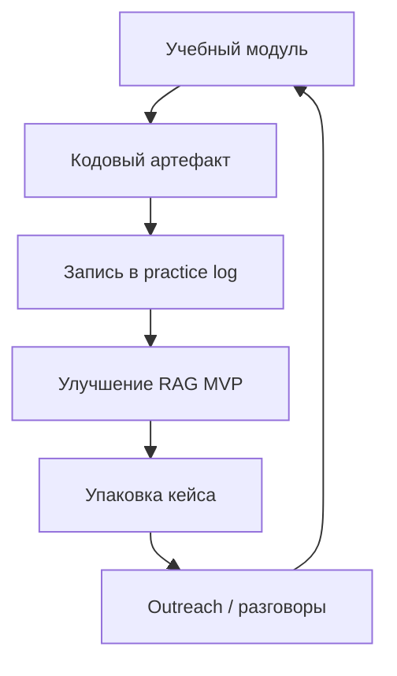

# AIMarket — рабочая карта проекта

## Решение

Стартовать не как «ML-студия» и не как разработчик больших моделей, а как один исполнитель с узким продаваемым результатом:

> **RAG-ассистент по документам компании с ответами и источниками.**

Основная ниша: [[niche-1-llm-fintech-legal|LLM/RAG для финтеха и legal/document workflows]].  
Вторая ступень: [[niche-3-asr-tts-voice|ASR/TTS и транскрипция+саммари]].  
Отложенная ступень: [[niche-2-cv-industrial-medical|CV для промышленности]], когда появятся деньги, данные и доступ к реальным заказчикам.

## Порядок работы

1. Пройти [[course-ml-training]] не «в теорию», а до артефактов в [[ml-training-practice-log]].
2. Параллельно собрать [[rag-mvp-spec|RAG MVP]] как портфельный кейс.
3. Каждую неделю идти по [[solo-90-day-execution-backlog]], а не держать план в голове.
4. После готовности MVP начать outreach по [[offer-and-client-acquisition]].

## Файлы проекта

| Файл | Для чего |
|---|---|
| [[ml-market-research-2026]] | Верхнеуровневый анализ рынка ML-заказов и выбор ниш |
| [[niche-1-llm-fintech-legal]] | Детальная ниша LLM/RAG для финтеха и legal |
| [[niche-2-cv-industrial-medical]] | Детальная ниша CV, отложенная для соло-старта |
| [[niche-3-asr-tts-voice]] | Детальная ниша ASR/TTS, вторая продуктовая линия |
| [[solo-monetization-plan]] | Стратегия заработка одному без команды |
| [[course-ml-training]] | Курс знаний по обучению/дообучению ML-моделей |
| [[ml-training-practice-log]] | Трекер заданий, метрик и доказательств готовности |
| [[rag-mvp-spec]] | Спецификация первого портфельного MVP |
| [[solo-90-day-execution-backlog]] | Недельный backlog на 90 дней |
| [[offer-and-client-acquisition]] | Оффер, цены, discovery, outreach |

## Definition of Done

Проект готов к первому коммерческому outreach, когда выполнено:

- [ ] Есть рабочий RAG по 20–100 документам.
- [ ] Каждый ответ содержит источник: документ, фрагмент, страницу/секцию, если доступно.
- [ ] Есть eval-набор минимум из 20 вопросов с ожидаемыми ответами.
- [ ] Есть таблица качества: retrieval hit-rate, answer correctness, hallucination/error cases.
- [ ] Есть API или простой UI.
- [ ] Есть README, демо-видео 2–3 минуты и one-pager с оффером.
- [ ] Есть список 30 потенциальных клиентов/контактов.
- [ ] Есть 3 варианта сообщения для outreach и 1 discovery-сценарий.

## Еженедельный цикл

## Ближайшие 7 дней

- [ ] Создать репозиторий `rag-document-assistant`.
- [ ] Выбрать 20–50 публичных документов для MVP: договоры, регламенты, политики, инструкции.
- [ ] Закрыть модули 1–2 в [[course-ml-training]] и записать доказательства в [[ml-training-practice-log]].
- [ ] Поднять минимальный pipeline: загрузка документов → чанки → эмбеддинги → поиск top-k.
- [ ] Начать список клиентов: юридические бутики, бухгалтерские/финансовые аутсорсеры, SMB с большим документооборотом.

