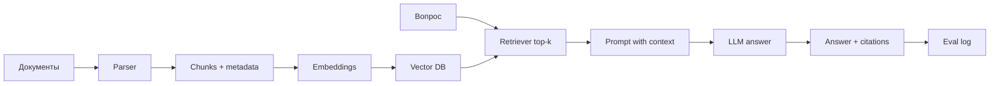

# MVP: RAG-ассистент по документам

## Назначение

Портфельный продукт для первого заработка одному: ассистент отвечает на вопросы по набору документов и показывает источники. Это практический капстоун из [[course-ml-training]] и первый оффер из [[solo-monetization-plan]].

## Пользователь

Первый целевой пользователь — не крупный банк, а клиент с коротким циклом принятия решения:

- юридический бутик 3–20 человек;
- бухгалтерский/финансовый аутсорсер;
- консалтинг/аудит SMB;
- компания с большим количеством регламентов, договоров, инструкций.

## Проблема

Сотрудники тратят время на поиск ответа в документах, путают версии, пересказывают без ссылки на первоисточник и регулярно эскалируют вопросы старшим специалистам.

## Обещаемый результат

За 2 недели клиент получает работающий прототип:

- загрузка документов;
- поиск релевантных фрагментов;
- ответ на вопрос;
- ссылки на источник;
- простая оценка качества на вопросах клиента;
- API или минимальный UI.

## Scope MVP

Входит:

- PDF/DOCX/TXT/Markdown документы;
- 20–100 документов в первом кейсе;
- chunking с сохранением метаданных: файл, страница/секция, позиция;
- embeddings + vector search;
- генерация ответа только на основе найденного контекста;
- отказ отвечать, если контекста недостаточно;
- eval-набор 20–50 вопросов;
- README и демо-видео.

Не входит в первый MVP:

- обучение foundation model с нуля;
- сложный multi-agent workflow;
- on-prem enterprise deployment;
- интеграция с СЭД/CRM;
- юридически значимые заключения без проверки эксперта;
- обработка секретных данных клиента в портфельном публичном демо.

## Архитектура

## Рекомендуемый стек

Минимальный стек для портфолио:

- Python;
- FastAPI для API;
- LlamaIndex или свой минимальный pipeline;
- Qdrant локально через Docker или pgvector, если удобнее Postgres;
- sentence-transformers/Hugging Face embeddings или API embeddings;
- любой доступный LLM API либо локальная небольшая модель для демо;
- MLflow или простой CSV/JSON лог для eval-результатов.

Для первого кейса важнее измеримость и источники, чем «самый модный фреймворк».

## Критерии приёмки MVP

- [ ] Документы загружаются повторяемо одной командой.
- [ ] Векторный индекс пересобирается без ручных шагов.
- [ ] На каждый ответ выводятся минимум 1–3 источника.
- [ ] Если источник не найден, система честно отвечает «не нашёл в документах».
- [ ] Есть eval-набор минимум из 20 вопросов.
- [ ] Для каждого вопроса записаны: найденные chunks, ответ, ожидаемый ответ, оценка correct/partial/wrong.
- [ ] Retrieval hit-rate ≥ 70% на первом наборе.
- [ ] Answer correctness ≥ 60% на первом наборе.
- [ ] Есть список 5–10 типичных ошибок и план улучшения.
- [ ] Есть API endpoint `/ask`.
- [ ] Есть README: проблема, решение, запуск, метрики, ограничения.
- [ ] Есть демо-видео 2–3 минуты.

## Eval-набор

Минимальная таблица:

| id | Вопрос | Ожидаемый ответ | Ожидаемый источник | Retrieved source | Ответ модели | Оценка | Комментарий |
|---|---|---|---|---|---|---|---|
| 001 |  |  |  |  |  |  |  |

Оценка:

- `correct` — ответ верный и источники релевантны;
- `partial` — смысл верный, но источник слабый или ответ неполный;
- `wrong` — ответ неверный, источник не подтверждает утверждение;
- `no_answer_ok` — система честно отказалась, потому что ответа нет в документах.

## Backlog разработки

### Версия 0.1 — локальный прототип

- [ ] Выбрать документы.
- [ ] Написать loader.
- [ ] Реализовать chunking.
- [ ] Посчитать embeddings.
- [ ] Сохранить индекс.
- [ ] Реализовать top-k retrieval.
- [ ] Вывести найденные chunks без LLM.

### Версия 0.2 — ответы с источниками

- [ ] Собрать prompt с контекстом.
- [ ] Добавить LLM answer.
- [ ] Добавить формат citations.
- [ ] Добавить отказ при низком score.
- [ ] Прогнать 10 вопросов руками.

### Версия 0.3 — измеримость

- [ ] Создать eval-набор 20–50 вопросов.
- [ ] Автоматически сохранять результаты.
- [ ] Посчитать retrieval hit-rate.
- [ ] Посчитать answer correctness вручную или полуавтоматически.
- [ ] Сделать таблицу ошибок.

### Версия 0.4 — упаковка

- [ ] FastAPI endpoint `/ask`.
- [ ] README.
- [ ] Скриншоты.
- [ ] Демо-видео.
- [ ] One-pager по шаблону из [[offer-and-client-acquisition]].

## Демо-сценарий

1. Показать проблему: «ищем ответ в 40 документах вручную».
2. Задать вопрос ассистенту.
3. Показать ответ и источники.
4. Задать вопрос, которого нет в документах.
5. Показать честный отказ.
6. Показать eval-таблицу и ограничения.
7. Закончить предложением: «за 2 недели делаю такой прототип на ваших документах».

